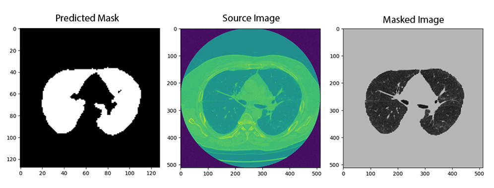

# U-Net for Lung Segmentation
This project implements a U-Net model for the task of lung segmentation on medical images. The model is implemented in PyTorch and can be used for other image segmentation tasks as well.



## Files
The following files are included in the project:

•	datasets.py: Contains code for loading and preprocessing the dataset.

•	entire_model.pt: Pretrained weights for the U-Net model.

•	inference.py: Contains code for running inference on test images using the trained model.

•	losses.py: Contains implementation of loss functions for training the model.

•	Prediction.ipynb: A Jupyter notebook for demonstrating how to use the trained model for inference.

•	requirements.txt: A file listing all the required Python packages for the project.

•	trainer.py: Contains implementation of the training loop for the U-Net model.

•	Training.ipynb: A Jupyter notebook for demonstrating how to train the U-Net model.

•	transformations.py: Contains implementation of various data augmentation techniques.

•	unet.py: Contains implementation of the U-Net model.
## Usage
Clone the repository to run the code locally:
```bash
  git clone https://github.com/xuzzu/deep-segmentation.git

```


### Training
To train the U-Net model, run the Training.ipynb notebook. This notebook contains code for loading the dataset, training the model, and saving the trained weights to disk.
### Inference
To run inference on test images using the trained model, run the Prediction.ipynb notebook. This notebook contains code for loading the pretrained weights, loading test images, and running inference using the trained model.
## Requirements
All the required Python packages are listed in the requirements.txt file. You can install them by running the following command:
```bash
pip install -r requirements.txt

```

